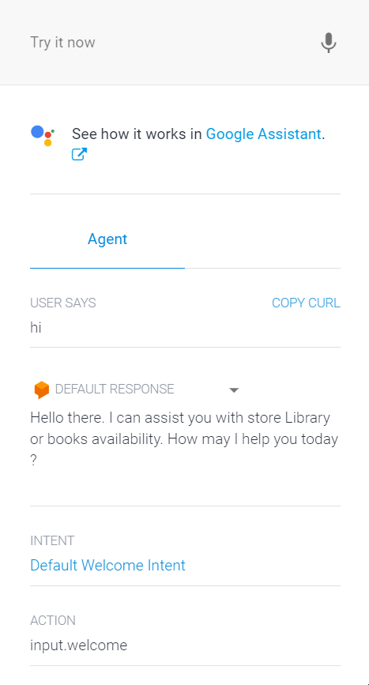

# Library Enquiry Chat Agent Using Dialogflow

A Chatbot Agent Created Using Dialogflow API and Cloud Natural Language API in Google Cloud Platform. 
I made this while learning, "Building Conversational Experiences with Dialogflow" on Coursera.

I created this Library Agent considering, How convenient it can be to check the availability of a book in a library without going there in person, and if the desired book is available only then you may go and pick up the book. This agent also asks if you want to make any xerox copies of anything at the library I added this question because some libraries have xerox services. If this Library Enquiry Agent is implemented for real it can save a lot of time. Suppose, you want to borrow a book from your college library, You can ask the Library Agent if the book you require is available or not. If yes, the book will be issued in the user's name and you can pick it up from the library.
It seems very cool to me. I will try to figure out if this can be improved.
